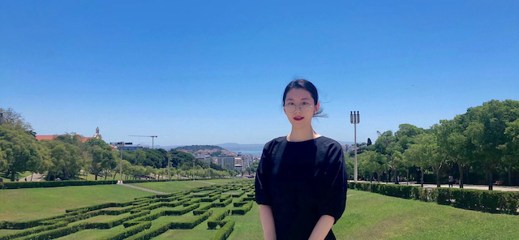

## Liang Zhao  [liɑŋ˥˩ tʂɑʊ̯˥˩] 赵靓

Hi, I am a PhD student at the Department of Language and Linguistic Science, University of York (2019-2023). I work on production and perception of lexical tone variation in Mandarin dialects, with a particular interest in the perceptual mechanisms and factors involved in processing familiar and unfamiliar lexical tones. My general research areas include speech perception, tone perception, corpus phonetics and phonology.  

Before coming to York, I received MA in Linguistics from UCL with Distinction (2017) and worked as a curriculum analyst in Offcn Education & Technology based in Beijing, China (2018).

Outside of work, I am a fan of science fiction and enjoy cooking. I also play the piano for relaxation and fun.

## Contact information

Email: liang.zhao@york.ac.uk (York); liang.zhao.lz@outlook.com (personal)

Twitter @[liangzhaolz](https://twitter.com/liangzhaolz)

ResearchGate @[Liang-Zhao-99](https://www.researchgate.net/profile/Liang-Zhao-99)

